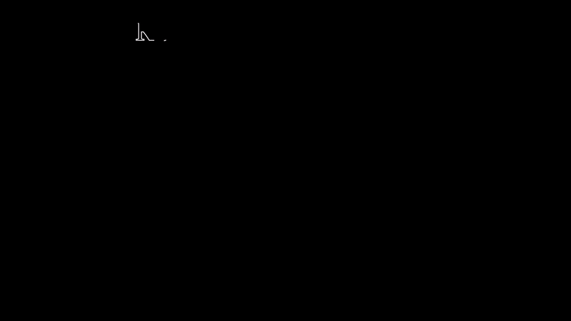

# RandomForest Animation

This repository contains a Manim animation illustrating the working of a RandomForest classifier. Depending on the flag variable in `animation.py`, the classification result will be `1` if set to `True`.

## Setup Instructions

Follow these steps to set up the environment and run the animation:

### 1. Clone the Repository
```bash
git clone https://github.com/GeronBeli/RandomForestAnimation.git
cd RandomForestAnimation
```

### 2. Create a Virtual Environment
Set up a virtual environment to manage dependencies:
```bash
python -m venv venv
```


### 3. Activate the Virtual Environment
* Windows: 
```bash
venv\Scripts\activate
```

* Mac/Linux:
```bash
source venv/bin/activate
```

### 4. Install Dependencies
Install the required dependencies using `pip`:

```bash
pip install -r requirements.txt
```

## Running the Animation
The animation logic resides in the `animation.py` file. A flag variable determines the classification result.

### Steps to Run:
1. Open animation.py in your code editor.
2. Locate the FLAG variable
3. Set the flag to True for the result to be 1, or False otherwise:
4. Run the animation script:
```bash
manim -pqh animation.py RandomForest
```

